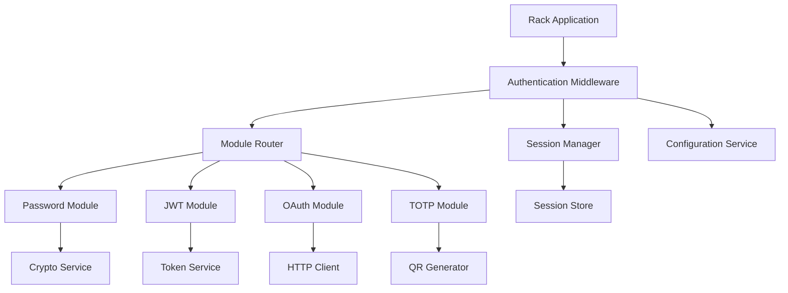
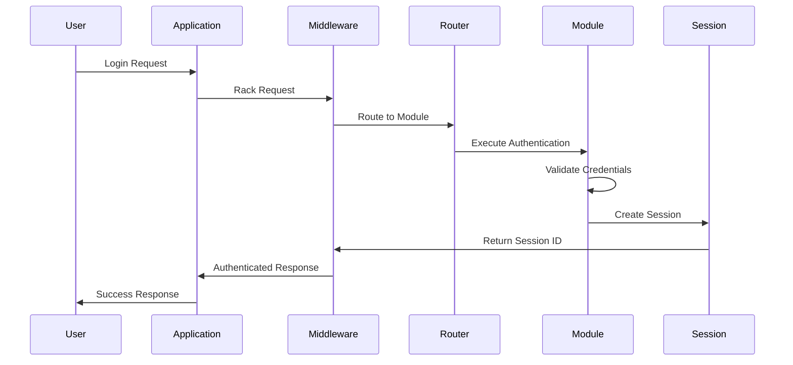
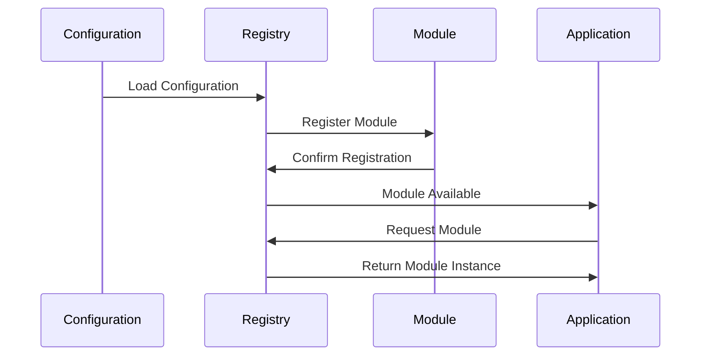

# Technical Design Document

## Overview
ModularAuthは、deviseやwardenに依存しない独自実装のモジュラー認証gemです。Rackミドルウェアベースの軽量なアーキテクチャで、パスワード、JWT、OAuth、多要素認証など、多様な認証方式を柔軟に組み合わせることができる認証フレームワークを提供します。

**Purpose**: この機能は、開発者に外部依存なしで高速な認証処理を提供し、任意のRackアプリケーションで利用可能なモジュラー認証システムを実現します。

**Users**: 開発者、システム管理者、エンドユーザーが、それぞれの役割に応じて認証機能を利用します。

**Impact**: 現在の認証gem（devise、warden）に依存する状況を、ゼロ依存の独自実装に変更し、より軽量で柔軟な認証システムを提供します。

### Goals
- 外部gemに依存しない独立した認証システムの構築
- モジュラーアーキテクチャによる柔軟な認証方式の組み合わせ
- 高パフォーマンス（50ms以下）と軽量性（20MB以下）の実現
- 任意のRackアプリケーションでの利用可能性

### Non-Goals
- 既存のdevise/wardenアプリケーションとの完全な互換性
- リアルタイム通信（WebSocket）のサポート
- 分散システム向けの複雑な認証フロー

## Architecture

### High-Level Architecture



**Architecture Integration**:
- 既存パターンの保持: Rackミドルウェアパターン、モジュールシステム
- 新規コンポーネントの根拠: 各認証方式の独立実装、設定駆動の認証フロー
- 技術スタック整合性: Ruby標準ライブラリのみ使用、Rackベース
- Steering準拠: ゼロ依存設計、モジュラーアーキテクチャ

### Technology Stack and Design Decisions

**Core Technology Stack**:
- **Language**: Ruby 3.1+（最新の言語機能を活用）
- **Middleware**: Rack 2.0+（ミドルウェア基盤）
- **Dependencies**: 標準ライブラリのみ（ゼロ依存設計）

**Key Design Decisions**:

1. **Decision**: モジュールベースの認証アーキテクチャを採用
   - **Context**: 複数の認証方式を柔軟に組み合わせる必要がある
   - **Alternatives**: 単一クラスでの全認証方式実装、継承ベースの階層構造
   - **Selected Approach**: 各認証方式を独立したモジュールとして実装し、レジストリで管理
   - **Rationale**: 開放閉鎖の原則に従い、新規認証方式の追加が容易
   - **Trade-offs**: 複雑性の増加 vs 拡張性と保守性の向上

2. **Decision**: 外部gem依存を完全に排除
   - **Context**: 軽量性と独立性を重視し、外部依存による脆弱性を回避
   - **Alternatives**: 最小限の外部gem使用、完全な外部依存
   - **Selected Approach**: 標準ライブラリのみを使用した独自実装
   - **Rationale**: セキュリティリスクの最小化、パフォーマンスの最適化
   - **Trade-offs**: 実装工数の増加 vs 完全な制御と軽量性

3. **Decision**: 設定駆動の認証フロー制御
   - **Context**: 様々な環境や要件に応じた柔軟な設定が必要
   - **Alternatives**: ハードコードされた設定、ランタイム設定変更なし
   - **Selected Approach**: YAML/Ruby設定ファイルと環境変数の組み合わせ
   - **Rationale**: 運用時の柔軟性とデプロイメントの簡素化
   - **Trade-offs**: 設定の複雑性 vs 運用の柔軟性

## System Flows

### Authentication Flow



### Module Registration Flow



## Requirements Traceability

| Requirement | Requirement Summary | Components | Interfaces | Flows |
|-------------|-------------------|------------|------------|-------|
| 1.1 | モジュール登録 | Module Registry | register_module | Module Registration Flow |
| 1.2 | モジュール選択 | Module Router | select_module | Authentication Flow |
| 2.1 | Rack統合 | Authentication Middleware | call | Authentication Flow |
| 3.1 | パスワード認証 | Password Module | authenticate | Authentication Flow |
| 4.1 | JWT認証 | JWT Module | verify_token | Authentication Flow |
| 5.1 | OAuth認証 | OAuth Module | initiate_oauth | Authentication Flow |
| 6.1 | TOTP認証 | TOTP Module | verify_totp | Authentication Flow |
| 7.1 | セッション管理 | Session Manager | create_session | Authentication Flow |

## Components and Interfaces

### Authentication Domain

#### Authentication Middleware

**Responsibility & Boundaries**
- **Primary Responsibility**: Rackリクエスト/レスポンスサイクルでの認証処理の制御
- **Domain Boundary**: 認証フローのエントリーポイント
- **Data Ownership**: リクエストコンテキスト、認証状態
- **Transaction Boundary**: 単一リクエスト内での認証処理

**Dependencies**
- **Inbound**: Rackアプリケーション
- **Outbound**: Module Router, Session Manager, Configuration Service
- **External**: なし

**Contract Definition**

**Service Interface**:
```ruby
class AuthenticationMiddleware
  def initialize(app, options = {})
    # ミドルウェアの初期化
  end

  def call(env)
    # Rackリクエストの処理
    # 戻り値: [status, headers, body]
  end

  private

  def authenticate_request(env)
    # 認証処理の実行
  end

  def handle_authentication_failure(env)
    # 認証失敗時の処理
  end
end
```

- **Preconditions**: 有効なRackアプリケーション、適切な設定
- **Postconditions**: 認証状態の設定、適切なレスポンスの返却
- **Invariants**: リクエストコンテキストの保持、セキュリティポリシーの適用

#### Module Router

**Responsibility & Boundaries**
- **Primary Responsibility**: 認証リクエストに基づいて適切な認証モジュールを選択
- **Domain Boundary**: 認証モジュールの選択とルーティング
- **Data Ownership**: モジュールマッピング、ルーティングルール
- **Transaction Boundary**: 単一リクエスト内でのモジュール選択

**Dependencies**
- **Inbound**: Authentication Middleware
- **Outbound**: Module Registry, 各認証モジュール
- **External**: なし

**Contract Definition**

**Service Interface**:
```ruby
class ModuleRouter
  def initialize(registry)
    # ルーターの初期化
  end

  def select_module(request_context)
    # リクエストに基づくモジュール選択
    # 戻り値: 認証モジュールインスタンス
  end

  def route_authentication(request_context, module_instance)
    # 選択されたモジュールでの認証実行
    # 戻り値: 認証結果
  end
end
```

#### Module Registry

**Responsibility & Boundaries**
- **Primary Responsibility**: 認証モジュールの登録、管理、取得
- **Domain Boundary**: モジュールライフサイクル管理
- **Data Ownership**: モジュールインスタンス、設定情報
- **Transaction Boundary**: アプリケーション起動時、設定変更時

**Dependencies**
- **Inbound**: Configuration Service, Module Router
- **Outbound**: 各認証モジュール
- **External**: なし

**Contract Definition**

**Service Interface**:
```ruby
class ModuleRegistry
  def initialize
    # レジストリの初期化
  end

  def register_module(name, module_class, options = {})
    # モジュールの登録
  end

  def get_module(name)
    # モジュールの取得
    # 戻り値: モジュールインスタンス
  end

  def list_modules
    # 登録済みモジュールの一覧
    # 戻り値: モジュール名の配列
  end
end
```

### Authentication Modules Domain

#### Base Module

**Responsibility & Boundaries**
- **Primary Responsibility**: 全認証モジュールの共通インターフェース定義
- **Domain Boundary**: 認証モジュールの抽象化
- **Data Ownership**: 認証結果、エラー情報
- **Transaction Boundary**: 単一認証処理

**Dependencies**
- **Inbound**: 各具体的な認証モジュール
- **Outbound**: なし
- **External**: なし

**Contract Definition**

**Service Interface**:
```ruby
class BaseModule
  def initialize(options = {})
    # モジュールの初期化
  end

  def authenticate(credentials)
    # 認証の実行
    # 戻り値: AuthenticationResult
  end

  def valid_credentials?(credentials)
    # 認証情報の妥当性検証
    # 戻り値: boolean
  end

  def supported_credentials
    # サポートする認証情報の種類
    # 戻り値: シンボルの配列
  end
end
```

#### Password Module

**Responsibility & Boundaries**
- **Primary Responsibility**: ユーザー名/パスワードによる認証処理
- **Domain Boundary**: パスワード認証の実装
- **Data Ownership**: パスワードハッシュ、認証結果
- **Transaction Boundary**: 単一認証処理

**Dependencies**
- **Inbound**: Authentication Middleware
- **Outbound**: Crypto Service, User Store
- **External**: なし

**Contract Definition**

**Service Interface**:
```ruby
class PasswordModule < BaseModule
  def authenticate(credentials)
    # パスワード認証の実行
    # 戻り値: AuthenticationResult
  end

  def hash_password(password)
    # パスワードのハッシュ化
    # 戻り値: ハッシュ化されたパスワード
  end

  def verify_password(password, hash)
    # パスワードの検証
    # 戻り値: boolean
  end
end
```

#### JWT Module

**Responsibility & Boundaries**
- **Primary Responsibility**: JWTトークンによる認証処理
- **Domain Boundary**: JWT認証の実装
- **Data Ownership**: JWTトークン、署名情報
- **Transaction Boundary**: 単一認証処理

**Dependencies**
- **Inbound**: Authentication Middleware
- **Outbound**: Token Service, Crypto Service
- **External**: なし

**Contract Definition**

**Service Interface**:
```ruby
class JWTModule < BaseModule
  def authenticate(credentials)
    # JWT認証の実行
    # 戻り値: AuthenticationResult
  end

  def generate_token(payload)
    # JWTトークンの生成
    # 戻り値: JWTトークン文字列
  end

  def verify_token(token)
    # JWTトークンの検証
    # 戻り値: デコードされたペイロード
  end
end
```

### Core Services Domain

#### Session Manager

**Responsibility & Boundaries**
- **Primary Responsibility**: セッションの作成、管理、検証
- **Domain Boundary**: セッションライフサイクル管理
- **Data Ownership**: セッションID、セッションデータ
- **Transaction Boundary**: セッション作成から破棄まで

**Dependencies**
- **Inbound**: Authentication Middleware, 各認証モジュール
- **Outbound**: Session Store, Crypto Service
- **External**: なし

**Contract Definition**

**Service Interface**:
```ruby
class SessionManager
  def initialize(store, options = {})
    # セッションマネージャーの初期化
  end

  def create_session(user_id, metadata = {})
    # セッションの作成
    # 戻り値: セッションID
  end

  def validate_session(session_id)
    # セッションの検証
    # 戻り値: セッションデータまたはnil
  end

  def destroy_session(session_id)
    # セッションの破棄
    # 戻り値: boolean
  end
end
```

#### Crypto Service

**Responsibility & Boundaries**
- **Primary Responsibility**: 暗号化、ハッシュ化、署名処理
- **Domain Boundary**: 暗号化処理の提供
- **Data Ownership**: 暗号化キー、ハッシュ値
- **Transaction Boundary**: 単一暗号化処理

**Dependencies**
- **Inbound**: 各認証モジュール、Session Manager
- **Outbound**: なし
- **External**: なし

**Contract Definition**

**Service Interface**:
```ruby
class CryptoService
  def initialize(secret_key)
    # 暗号化サービスの初期化
  end

  def hash_password(password, salt = nil)
    # パスワードのハッシュ化
    # 戻り値: ハッシュ値とソルト
  end

  def verify_password(password, hash, salt)
    # パスワードの検証
    # 戻り値: boolean
  end

  def generate_hmac(data, key)
    # HMAC署名の生成
    # 戻り値: 署名文字列
  end

  def verify_hmac(data, signature, key)
    # HMAC署名の検証
    # 戻り値: boolean
  end
end
```

## Data Models

### Domain Model

**Core Concepts**:
- **AuthenticationResult**: 認証処理の結果を表現する値オブジェクト
- **User**: 認証対象のユーザーエンティティ
- **Session**: 認証状態を保持するセッションエンティティ
- **ModuleConfiguration**: 認証モジュールの設定を表現する値オブジェクト

**Business Rules & Invariants**:
- 認証結果は常に成功または失敗のいずれかである
- セッションは有効期限を持つ
- パスワードは常にハッシュ化されて保存される
- JWTトークンは署名検証を通過する必要がある

### Logical Data Model

**Structure Definition**:
- AuthenticationResult: result_type, user_id, session_id, error_message
- User: id, username, email, password_hash, created_at, updated_at
- Session: id, user_id, expires_at, metadata, created_at
- ModuleConfiguration: name, class_name, options, enabled

**Consistency & Integrity**:
- セッションはユーザーIDと一意に対応
- 認証モジュールは一意の名前を持つ
- パスワードハッシュは不可逆である

## Error Handling

### Error Strategy
認証処理における各エラータイプに対して適切な回復メカニズムを提供する。

### Error Categories and Responses
**User Errors (4xx)**:
- 無効な認証情報 → 認証失敗メッセージと再試行の案内
- 認証方式の不一致 → サポートされる認証方式の提示
- セッション期限切れ → 再認証の要求

**System Errors (5xx)**:
- モジュール初期化失敗 → アプリケーション起動停止
- 暗号化処理エラー → 内部エラーレスポンス
- セッションストアエラー → フォールバック処理

**Business Logic Errors (422)**:
- 認証ポリシー違反 → ポリシー説明と対処法の提示
- アカウントロック → ロック理由と解除方法の案内

### Monitoring
- 認証試行回数の追跡
- エラー率の監視
- セッション有効性の監視
- パフォーマンスメトリクスの収集

## Testing Strategy

### Unit Tests
- 各認証モジュールの個別機能テスト
- 暗号化サービスのハッシュ化/検証テスト
- セッションマネージャーのCRUD操作テスト
- モジュールレジストリの登録/取得テスト
- 設定サービスの読み込み/検証テスト
- エラーハンドリングの単体テスト
- バリデーション機能のテスト

### Integration Tests
- 認証ミドルウェアとモジュールルーターの連携テスト
- 複数認証モジュールの組み合わせテスト
- セッション管理と認証フローの統合テスト
- 設定変更時の動的更新テスト
- エラーハンドリングの統合テスト
- フレームワーク統合テスト（Rails、Sinatra、Hanami）

### E2E Tests
- 完全な認証フローのテスト（ログイン→認証→セッション維持→ログアウト）
- 異なる認証方式の切り替えテスト
- セッション期限切れ時の再認証テスト
- 複数ユーザーの同時認証テスト
- マルチテナント環境での認証テスト

### Performance Tests
- 高負荷環境での認証処理性能テスト
- メモリ使用量の監視テスト
- 同時接続数2000での安定性テスト
- セッション管理のスケーラビリティテスト
- レスポンス時間の継続的監視テスト

### Security Tests

#### Penetration Testing
- **ブルートフォース攻撃テスト**: パスワード認証に対する総当たり攻撃の検証
- **SQLインジェクション攻撃テスト**: 認証クエリに対するSQLインジェクション攻撃の検証
- **XSS攻撃テスト**: 認証フォームに対するクロスサイトスクリプティング攻撃の検証
- **CSRF攻撃テスト**: 認証処理に対するクロスサイトリクエストフォージェリ攻撃の検証
- **セッションハイジャック攻撃テスト**: セッションIDの予測可能性と盗用可能性の検証
- **JWT攻撃テスト**: JWTトークンの改ざん、リプレイ攻撃の検証
- **OAuth攻撃テスト**: OAuthフローに対する認可コードインジェクション攻撃の検証
- **TOTP攻撃テスト**: 多要素認証に対するリプレイ攻撃、タイミング攻撃の検証

#### Vulnerability Assessment
- **認証バイパス攻撃**: 認証を回避する攻撃手法の検証
- **権限昇格攻撃**: 通常ユーザーが管理者権限を取得する攻撃の検証
- **セッション固定攻撃**: セッションIDを固定化する攻撃の検証
- **パスワードリセット攻撃**: パスワードリセット機能の悪用攻撃の検証
- **アカウント列挙攻撃**: 有効なユーザーアカウントを特定する攻撃の検証
- **タイミング攻撃**: 認証処理の応答時間差を利用した攻撃の検証
- **サイドチャネル攻撃**: メモリ使用量や処理時間の差異を利用した攻撃の検証

#### Security Regression Tests
- **既知の脆弱性テスト**: CVEデータベースに登録された既知の脆弱性の検証
- **セキュリティパッチテスト**: セキュリティ更新後の回帰テスト
- **設定変更テスト**: セキュリティ設定変更時の影響検証
- **依存関係テスト**: 外部依存関係の脆弱性影響検証

#### Automated Security Testing
- **静的解析テスト**: コードの静的解析による脆弱性検出
- **動的解析テスト**: 実行時の動作解析による脆弱性検出
- **依存関係スキャン**: 使用ライブラリの脆弱性スキャン
- **セキュリティ設定テスト**: セキュリティ設定の妥当性検証

### Test Data Management
- **テスト用認証情報**: 各認証方式用のテストデータセット
- **攻撃シナリオデータ**: 各種攻撃パターンのテストデータ
- **境界値テストデータ**: 入力値の境界条件テストデータ
- **異常系テストデータ**: 不正な入力値やエラー条件のテストデータ

### Test Environment
- **隔離環境**: 本番環境に影響を与えないテスト環境
- **攻撃シミュレーション環境**: セキュリティテスト専用の環境
- **負荷テスト環境**: 高負荷テスト用の専用環境
- **マルチプラットフォーム環境**: 異なるOS、Rubyバージョンでのテスト環境

### Continuous Security Testing
- **CI/CD統合**: 継続的インテグレーションでの自動セキュリティテスト
- **定期スキャン**: 定期的な脆弱性スキャンの実行
- **監視アラート**: セキュリティイベントの自動監視とアラート
- **レポート生成**: セキュリティテスト結果の自動レポート生成

### Security Test Implementation

#### Penetration Testing Framework
```ruby
# セキュリティテスト用の専用フレームワーク
class SecurityTestFramework
  def initialize(auth_system)
    @auth_system = auth_system
    @attack_vectors = load_attack_vectors
  end

  def run_penetration_tests
    @attack_vectors.each do |attack|
      execute_attack(attack)
    end
  end

  private

  def execute_attack(attack)
    case attack.type
    when :brute_force
      test_brute_force_attack(attack)
    when :injection
      test_injection_attack(attack)
    when :session_hijacking
      test_session_hijacking(attack)
    end
  end
end
```

#### Specific Attack Test Cases

**ブルートフォース攻撃テスト**:
```ruby
def test_brute_force_attack
  # 1. 短時間での大量認証試行
  # 2. アカウントロックアウト機能の検証
  # 3. レート制限の有効性確認
  # 4. ログ記録の確認
end

def test_sql_injection_attack
  # 1. 認証クエリへのSQLインジェクション試行
  # 2. パラメータ化クエリの使用確認
  # 3. 入力値サニタイゼーションの検証
  # 4. エラーメッセージからの情報漏洩確認
end

def test_xss_attack
  # 1. 認証フォームへのXSSペイロード注入
  # 2. 出力エスケープの確認
  # 3. Content Security Policyの検証
  # 4. セッションクッキーのHttpOnly設定確認
end

def test_csrf_attack
  # 1. CSRFトークンなしでの認証試行
  # 2. トークン検証の有効性確認
  # 3. SameSite Cookie設定の検証
  # 4. リファラーヘッダー検証の確認
end

def test_session_hijacking
  # 1. セッションIDの予測可能性テスト
  # 2. セッションIDの推測試行
  # 3. セッション固定攻撃の検証
  # 4. セッションID再生成の確認
end

def test_jwt_attacks
  # 1. JWTトークンの改ざん試行
  # 2. 署名検証の有効性確認
  # 3. アルゴリズム変更攻撃の検証
  # 4. リプレイ攻撃の検証
end

def test_oauth_attacks
  # 1. 認可コードインジェクション攻撃
  # 2. ステートパラメータ検証の確認
  # 3. リダイレクトURI検証の確認
  # 4. スコープ昇格攻撃の検証
end

def test_totp_attacks
  # 1. TOTPコードのリプレイ攻撃
  # 2. タイミング攻撃の検証
  # 3. シークレットキー推測攻撃
  # 4. バックアップコードの悪用攻撃
end
```

#### Vulnerability Assessment Tests

**認証バイパス攻撃**:
```ruby
def test_authentication_bypass
  # 1. 認証なしでのアクセス試行
  # 2. 無効な認証情報でのアクセス試行
  # 3. 認証フローの迂回試行
  # 4. 管理者権限でのアクセス試行
end

def test_privilege_escalation
  # 1. 通常ユーザーでの管理者機能アクセス
  # 2. 権限チェックの迂回試行
  # 3. セッション権限の昇格試行
  # 4. トークン権限の昇格試行
end

def test_account_enumeration
  # 1. 存在しないユーザー名での認証試行
  # 2. エラーメッセージの差異確認
  # 3. レスポンス時間の差異確認
  # 4. ユーザー登録機能での列挙試行
end

def test_timing_attacks
  # 1. 認証処理の応答時間測定
  # 2. 異なる入力値での時間差確認
  # 3. サイドチャネル情報の漏洩確認
  # 4. 定数時間比較の実装確認
end
```

#### Security Test Automation

**自動化されたセキュリティテスト**:
```ruby
# RSpec統合セキュリティテスト
RSpec.describe "Security Tests" do
  describe "Authentication Security" do
    it "prevents brute force attacks" do
      # ブルートフォース攻撃の自動テスト
    end

    it "prevents SQL injection" do
      # SQLインジェクション攻撃の自動テスト
    end

    it "prevents XSS attacks" do
      # XSS攻撃の自動テスト
    end

    it "prevents CSRF attacks" do
      # CSRF攻撃の自動テスト
    end
  end

  describe "Session Security" do
    it "generates unpredictable session IDs" do
      # セッションIDの予測不可能性テスト
    end

    it "prevents session fixation" do
      # セッション固定攻撃の防止テスト
    end

    it "implements proper session timeout" do
      # セッションタイムアウトの実装テスト
    end
  end

  describe "Token Security" do
    it "validates JWT signatures" do
      # JWT署名検証のテスト
    end

    it "prevents token replay attacks" do
      # トークンリプレイ攻撃の防止テスト
    end

    it "implements proper token expiration" do
      # トークン有効期限の実装テスト
    end
  end
end
```

#### Security Test Data

**攻撃シナリオデータセット**:
```ruby
# セキュリティテスト用の攻撃データ
ATTACK_PAYLOADS = {
  sql_injection: [
    "'; DROP TABLE users; --",
    "' OR '1'='1",
    "admin'--",
    "admin'/*",
    "' UNION SELECT * FROM users --"
  ],
  xss_payloads: [
    "<script>alert('XSS')</script>",
    "javascript:alert('XSS')",
    "",
    "<svg onload=alert('XSS')>",
    "';alert('XSS');//"
  ],
  csrf_payloads: [
    "<form action='/auth/login' method='POST'>",
    "",
    "fetch('/auth/login', {method: 'POST'})"
  ],
  session_attacks: [
    "predictable_session_id",
    "session_id_manipulation",
    "session_fixation_attempt"
  ]
}
```

#### Security Monitoring

**セキュリティ監視とアラート**:
```ruby
class SecurityMonitor
  def initialize
    @attack_detection = AttackDetection.new
    @alert_system = AlertSystem.new
  end

  def monitor_authentication_attempts
    # 異常な認証試行の監視
    # ブルートフォース攻撃の検出
    # 地理的に異常なアクセスの検出
  end

  def monitor_session_anomalies
    # セッションの異常な動作の監視
    # セッションハイジャックの検出
    # 複数デバイスからの同時アクセスの監視
  end

  def generate_security_reports
    # セキュリティイベントのレポート生成
    # 攻撃パターンの分析
    # セキュリティ推奨事項の提供
  end
end
```

#### Security Test Execution Plan

**段階的セキュリティテスト実行**:
```ruby
# セキュリティテストの実行計画
class SecurityTestExecutionPlan
  def initialize
    @test_phases = [
      :unit_security_tests,
      :integration_security_tests,
      :penetration_tests,
      :vulnerability_assessment,
      :regression_tests
    ]
  end

  def execute_security_test_suite
    @test_phases.each do |phase|
      puts "Executing #{phase}..."
      execute_phase(phase)
      validate_phase_results(phase)
    end
  end

  private

  def execute_phase(phase)
    case phase
    when :unit_security_tests
      run_unit_security_tests
    when :integration_security_tests
      run_integration_security_tests
    when :penetration_tests
      run_penetration_tests
    when :vulnerability_assessment
      run_vulnerability_assessment
    when :regression_tests
      run_security_regression_tests
    end
  end
end
```

#### Security Test Quality Assurance

**セキュリティテストの品質保証**:
```ruby
# セキュリティテストの品質保証プロセス
class SecurityTestQA
  def initialize
    @test_coverage = TestCoverage.new
    @vulnerability_scanner = VulnerabilityScanner.new
    @security_metrics = SecurityMetrics.new
  end

  def validate_security_test_coverage
    # 1. 全認証機能のテストカバレッジ確認
    # 2. 全攻撃ベクターのテスト実行確認
    # 3. セキュリティ要件のテスト網羅性確認
    # 4. エッジケースのテスト実行確認
  end

  def validate_security_test_results
    # 1. 全セキュリティテストの成功確認
    # 2. 脆弱性スキャン結果の検証
    # 3. パフォーマンステスト結果の確認
    # 4. セキュリティメトリクスの妥当性確認
  end

  def generate_security_test_report
    # 1. テスト実行結果の集計
    # 2. 発見された脆弱性のレポート
    # 3. セキュリティ推奨事項の提供
    # 4. 継続的改善の提案
  end
end
```

#### Security Test Automation Pipeline

**CI/CD統合セキュリティテスト**:
```yaml
# .github/workflows/security-tests.yml
name: Security Tests

on:
  push:
    branches: [ main, develop ]
  pull_request:
    branches: [ main ]

jobs:
  security-tests:
    runs-on: ubuntu-latest
    steps:
      - uses: actions/checkout@v3
      
      - name: Setup Ruby
        uses: ruby/setup-ruby@v1
        with:
          ruby-version: 3.1.0
          
      - name: Install dependencies
        run: bundle install
        
      - name: Run unit security tests
        run: bundle exec rspec spec/security/unit/
        
      - name: Run integration security tests
        run: bundle exec rspec spec/security/integration/
        
      - name: Run penetration tests
        run: bundle exec rspec spec/security/penetration/
        
      - name: Run vulnerability scan
        run: bundle exec security_scan
        
      - name: Generate security report
        run: bundle exec security_report
```

#### Security Test Metrics

**セキュリティテストメトリクス**:
```ruby
# セキュリティテストのメトリクス管理
class SecurityTestMetrics
  def initialize
    @metrics = {
      test_coverage: 0,
      vulnerabilities_found: 0,
      vulnerabilities_fixed: 0,
      attack_vectors_tested: 0,
      false_positives: 0,
      test_execution_time: 0
    }
  end

  def track_test_coverage
    # セキュリティテストのカバレッジ追跡
    # 目標: 100%のセキュリティ機能カバレッジ
  end

  def track_vulnerability_metrics
    # 脆弱性発見・修正の追跡
    # 目標: 発見された脆弱性の100%修正
  end

  def track_attack_vector_coverage
    # 攻撃ベクターのテスト網羅性追跡
    # 目標: 全攻撃ベクターのテスト実行
  end

  def generate_security_dashboard
    # セキュリティテスト状況のダッシュボード生成
    # リアルタイムでのセキュリティ状況の可視化
  end
end
```

## Security Considerations

### Threat Modeling
- **認証情報の漏洩**: パスワードハッシュ化、JWT署名検証
- **セッションハイジャック**: セキュアなセッションID生成、HTTPS強制
- **ブルートフォース攻撃**: アカウントロックアウト、レート制限
- **CSRF攻撃**: CSRFトークン検証、SameSite Cookie設定

### Security Controls
- 強力なパスワードハッシュ化アルゴリズム（bcrypt相当）
- JWT署名の検証と有効期限チェック
- セッション固定攻撃の防止
- 入力値の検証とサニタイゼーション

### Data Protection
- 機密情報の暗号化保存
- ログからの機密情報除外
- セッションデータの最小化
- データ保持期間の制限

## Performance & Scalability

### Target Metrics
- 認証処理: 50ms以下
- セッション検証: 20ms以下
- メモリ使用量: 20MB以下（基本動作）
- 同時接続: 2000接続以上

### Scaling Approaches
- 水平スケーリング: ステートレスな認証処理
- セッションストアの分散化
- 認証モジュールの並列処理
- キャッシュ戦略の実装

### Optimization Techniques
- 認証結果のキャッシュ
- セッション検証の最適化
- 不要なモジュールの遅延読み込み
- メモリ使用量の監視と最適化
